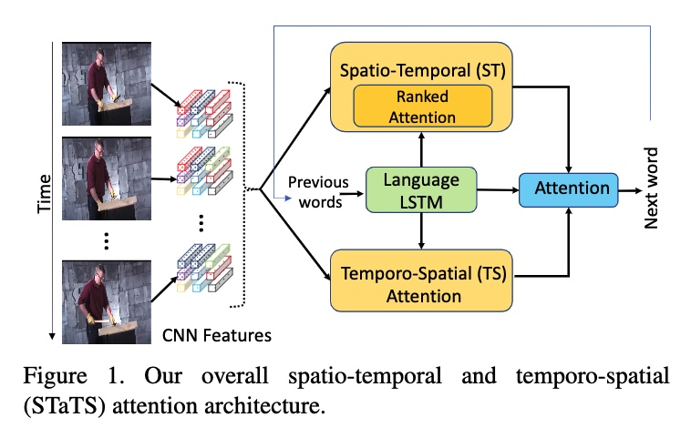

# Video Captioning@2018 CVPR
这个显然是一个multimodal transfer的工作，但是事实上learning an effective mapping from the visual sequence space-》language space是一个挑战性的任务，因为long-term multimodal dependency modalling+semantic misalignment

## 1. M^3: Multimodal Memory Modelling for Video Captioning
### 1.Introduction
1.看到对于long-term 序列信息而言，记忆建模是非常有意义的。并且working memory是visual attention的关键点。

目前现有的方法比如一个single视觉表达对于capture所有的信息over a 长期～是不好的。
### 2.novelty
我们就是提出了一个M^3(多模态记忆建模)去描述视频，build a visual and textual shared memroy去建模长时间的视觉文本依赖以及进一步指导视觉注意力到描述的targets来解决视觉textual alignments。

1.这里就是我们是first model多模态数据通过选择 read/write both 视觉内容以及句子内容with a共享的记忆结构，并且将其在视频caption中进行使用。

### 3.Multimodal Memory的解析
因为我们这里存在bimodal信息，i.e., video and language, 所以我们使用两个独立的read/write操作去指导信息交互。

## 2. Relational Graph Learning for Grounded Video Description Generation@MM 2020
ZJU@Grounded video Description(GVD)这个就是caption model能够动态决定合适的video regions并且产生对应的description。这个就可以帮助解释我们的caption model的决策，而且prevent the model from hallucinating object words(这个就是对于目标和单词的幻听～)

### 1.Video Caption现有的工作总结
1.现在的caption模型的一个主要的缺点就是objects hallucination。caption模型就会产生一些描述objects根本不在视频中出现的，因为相似的语义contexts或者pre-extracted priors during 训练阶段。

2.GVD这个任务就是grounded video Description就是尝试改进grounding能力。这个的想法就是我们学习ground related video regions来预测下一个word。那么这样的设置就可以teach models 仅仅explicitly依赖对应的evidence来产生对应的描述。

3.而目前的GVD的方法有一些limitation:
```
1)我们只是关注related regions of objects，而忽视了对应的fine details，比如related objects或者attributes of grounded object。（这样的话我们很容易产生一个coarse-grained 描述性的句子）

2)尤其有些语句比如climb up or down本身就是推理的结果@序列化的frames，而没有具体的spatial regions可以在words中找到。所以我们仅仅依赖视觉某个region的信息可能会产生不合适的word generation。
```

4.因此一个对于GVD（Grounded Video Description）的一个很重要的优化方向就是尝试产生更佳finegrained的信息@@fine/correct。

## 我们为什么想要使用scene graph呢？
1.SG可以提供一个abstraction of objects and their complex relationships。那么就可以表示非常fine-grained 的信息了。SG在一方面提供了互补的信息@帮助caption model来生成fine-grained phrases。比如man in blue shirt。

2.SG可以帮助ground 正确的relation word

3.

## 3.Syntax-Aware Action Targeting for Video Captioning
## 1.Motivation
1.现有的方法的趋势就是识别video clip中的objects，这个就可以改进整个caption的精度for 两个好处。

1）冗余的static information@更可能去描述targeted instance in video，

2）co-occurrence of objects帮助captioner去记住video，description pairs。

2.但是这些方法就是忽视了action learning，就是过度focus于共现关系，比如车和人在一起就说是drive，可是事实上不对。

## 2.我们的技术细节
1.我们这里就是显示target actions in video clips去支持一个除了语言prior指导的captioner以外，还利用了action信息。

2.不同于之前的所有的work，所有word的POS tag用来指导caption process。我们仅仅关注于使用convey the most visual information去指导caption的整个过程。

### 我们的模型就是首先generate 场景表达使用both regional feature@self-attn。接着，我们使用一个


Cxe就是map an input sequence of regional features通过self-attn来获得对应的scene representation，u 因为句子中的syntax部分和scene更加相关。然后将2D+3D当作global context。

### 3.2. 在我们已经获得了对应的每个frame的scene representation之后
Intuitively，subject and object rely more on spatial appearance of regions。然后predicate需要视频clip中的temporal information。

同时predicate是否主动/被动还是通过action信息来决定subject。

主要做的工作就是使用global feature来计算attn。获得对应的feature。

## 4.Spatio-Temporal Ranked-Attention Networks for Video Captioning@AAAI2021
## Motivation
1.虽然attn类型的方法可能只是考虑frame-level或者clip-level representations of videos，这个的话就啃呢个不能capture specific details of the scene或者表达了太多的information that is unrelated to the primary content～

2.而Faster-RCNN这些就啃呢个会miss out一些context有关的visual cues related to human actions～

3.action proposals就可能会计算上非常expensive。**我们的工作就是和上面相似，到那时探索attention以一个新的方式。**

## 我们的创新点
1.ST 这种先spatial再attention的将attention space从multiplicative to additive了。

2.然后使用一种ranked lstm来保存时序上的信息。rank-SVM。**避免了计算复杂度one needs to use for rank-pooling～**

3.TS的模块提出的点就是并不是所有的words in captions都依赖于such temporally varing holistic features。比如subject/object这样的words诶能更需要从单个representative frame中间来获得更加localized feature。**那么我们这里就是一个novel temporo-spatial attention model that provides a shortcut for visual relationship inference。**

TS就是让我们首先使用选择specific frames来attend to，然后使用spatial atteniton to the spatial feature representations of these frames～

4.然后就是两者的一个weighted attention。



# 5.Object Relational Graph with Teacher-Recommended Learning for Video Captioning
## Motivation
1.现有的模型lack adequate 视觉表达因为忽视了interaction between object，以及足够的training for content-related words 由于长尾问题。

## 我们的工作1
1。ORG based encoder，就是capture more detailed interaction features to enrich visual representations。

2.teacher-recommended learning去使用外界的语言模型来集成abundant linguistic knowledge into the caption model。

## Introduction的介绍
这个任务主要需要twofold来解决:

1.how to extract discriminative features to represent the contents of videos

2.how to leverage the existing visual features to match the corresponding captioning corpus.

### 对于视觉表达而言先前的工作


这个就是各种各样的任务已经证明relationship between objects is vital，which also plays an important role in generating a more detailed and diverse description 
for a video。

2.对于caption而言，统计一下句子里面的各种成分。表示有很多function words和common words，比如说the和man，但是这个就比较远离真实的content-specific words in number。

那就是长尾问题，那些重要的词反而缺乏足够的training。

**虽然这种长尾问题可以用来give different 权重到不同的words，但是这个问题不能fundamentally解决。那么怎么能够要求caption model不仅理解视觉信息而且grasp linguistic ability using such a small number of samples？这个问题显然太hard+heavy了，那么我们为什么不使用一个ready-made ELM比如Bert作为teacher来补足这个缺陷呢？**

## 我们的工作就是
1.construct a learnable ORG去全方面探索spatial and temporal relationships between objects。@GCN。
**我们探索两种图**
1）partial object relational graph连接objects in the same frame；

2）complete object relational graph（C-ORG）所有的objects之间的连接。

2.就是这个TRL工作啦。@借鉴机器翻译的工作而已。


## 3.1. Object Relational Graph based Visual Encoder
这里我们就是使用2D CNN+3D CNN来抽取appearance features/motion fetaures。

然后就是拿来做relational reasoning的object feature～


关于P-ORG就是每个frame都用一个graph来做，虽然object proposals appearing in different frames可能属于相同的entity，但是它们由于不同的states，所以还是不同的nodes。

与此同时，C-ORG就是一个complete graph这里就是对于每个frame，不过我们选择了top-k corresponding nodes to connect。

然后**这种feature表达结合appearance和motion features来综合一起表示videos～**

## 3.2. Description Generation
在获得最后的足够的video features，我们就是使用一个层次性decoder with a temporal-spatial attention model去一步一步生成linguistic decriptions

Attn-LSTm+Language LSTM。

## 关于咱们的多个frame的object feature如何aggregate？
我们的操作是什么？

1.就是说首先使用原始的object feature来进行聚合。（这里就是用相似性来计算，然后同一个object使用weighted sum。

2.接着使用spatial attention来关注个体的feature。abstract local context feature。

**所以本质上属于一个temporal-spatial的操作**

## The evaluation of ORG.
这个实验结果就是证明全局的Graph效果比一般的要好。看来这里是因为综合了全部的信息。

top5这里就足够了。说明就是这样不是那么冗余。

# 6.XlanV Model with Adaptively Multi-Modality Feature Fusing for Video Captioning
## Motivation:
1.这篇文章就是为了综合融合2D CNN这种static feature和3D CNN这种dynamic motion feature的工作。**融合方式主要根据linguistic来决定**

## 我们的工作的核心
1.extend X-Linear Attention Networks@image caption, with adaptive multi-modality fusing module.

2.但是我们注意到dynamic features很大程度上取决于视频的质量。许多给定的pretraining GIF videos往往太短而不能extract dynamic features。

3.一些GIF videos是保持静止的，而一些视频包含了rich motion information～**对于抽取有用的特征是非常困难的**

采样率也应该不一样。


这个就是image caption提出的module。这个比起attention机制这种探索1st order的交互，还探索了2nd order的交互。

## 2.2 Adaptive Multi-Modality Fusion
这个就是对于每个timestep的多模态特征都在进行自适应融合。

gate fusion啦。对这个的很好的描述就是our model is capable of adaptively weighting these two fea-tures to make better utilization of one kind of feature when theother one is not so useful at the current time step.

就是代表adatively weighting these two features。

# 7.Learning to Discretely Compose Reasoning Module Network for Video Captioning@IJCAI2020
## Motivation
1.reasoning module networks to equip the existing encoder-decoder framework with the above reasoning capacity～

**包含了几个模块**:

1)3 sophisticated spatio-temporal reasoning modules;

2)dynamic and discrete module selector trained by a linguistic loss with a Gumbel Approximation.

## 技术分析
这里设计了三个推理模块
1.定位one region to generate visual words；

2.relate pairwise regions to generate action words；

3.generate function words according to the language context～比如is等等。

## video caption不同于vqa的几点
1.视频对于推理分解比起图像更困难。

2.不像questions或者referring expressions which are given in advance。视频descriptions are not available during the inference～

**因此我们的模型需要动态分解推理过程along the generation process。**

## 1.技术详解
a) LOCATE module: 定位一个single region over the video 通过一个spatial-temporal attention。产生对应的视觉words。

b) RELATE module: 这个就是首先检测object of each frame，然后将两个做成一对来建模action～

c) FUNC module: 根据现有的language context。我们生成function words～

2.为了让这个推理过程更顺理成章，我们要做的事情就是使用一个dynamic and discrete module selector结合Gumbel Approximation来将这几个结合一起。


# 8.Augmented Partial Mutual Learning with Frame Masking for Video Captioning@
## Motivation
1.这个就是针对集成学习的一个改进。这里就是先前的工作并没有探索joint training of multiple model并没有探索过。

2.Jointly training of multiple model have not been explored in previous works.

**Augmented Partial Mutual Learning training method**
## 我们的技术就是
1.使用多个decoders are trained jointly with mimicry losses between different decoders and different input variations。

## 总结Introduction
1.现有的decoder都是rnn/transformer那种，所以如果能一起利用起来设计这样一个模块对于增进decoding robustness is natural。

**一个很好的解决方法就是集成多个模型。**

2.集成的方法:
1)不同的架构或者不同的初始值。但是简单的集成不太行，因为并没有能够很好利用相互之间的mutual interaction during training以及其在推断阶段中的耗尽的资源limit its practical application～

3.我们是如何利用这些decoder呢？我们就是使用mutual learning的思想transfer knowledge among a group of peer models@知识蒸馏。

**但是不像Knowledge Distillation，mutual learning并没有限制模型的种类以及size。所以所有的training models都可以作为mutual teachers去相互指导对方via minimize a mimicry loss which measures the prediction discrepancy among peer-models with respect to the same inputs～**

这种mimicry loss 可以当作a kind of regularization which improves the 泛化性能。

4.我们的方法不同于集成学习，因为我们是在探索使用each single model with the help of other peer models in the group。就是互帮互助。

5.本文指出常用的video caption使用的模型总是饱含several caption annotations for one video。最常用的方法将each video-caption pair作为一个新的training sample～
**这个方法就是将混淆video caption model使用交叉熵损失，因为相同的identical input就会被map到不同的targets**，*one-to-many mapping problem～*但是之前的方法并没有探索这些。

**为了解决这个问题，我们就是提出一个创新的annotation-wise frame masking approach which 嵌入视频特征和caption注解into a mutual hidden space and mask the frames which have lower相似度withlanguage embedding～**将one-to-many mapping转化到one-to-one mapping。


# 9.Non-Autoregressive Coarse-to-Fine Video Captioning@AAAI2021
## Motivation@
1.现有的主流的视频caption 遭受到slow inference speed由于sequential manner of autoregressive decoding。


# 9.Non-Autoregressive Coarse-to-Fine Video Captioning视频
# 9.Non-Autoregressive Coarse-

# 7.Learning to Discretely Compose Reasoning Module Network for Video Captioning#
# 7.Learning to Discretely Compose Reasoning Module Network for Video Captioning


