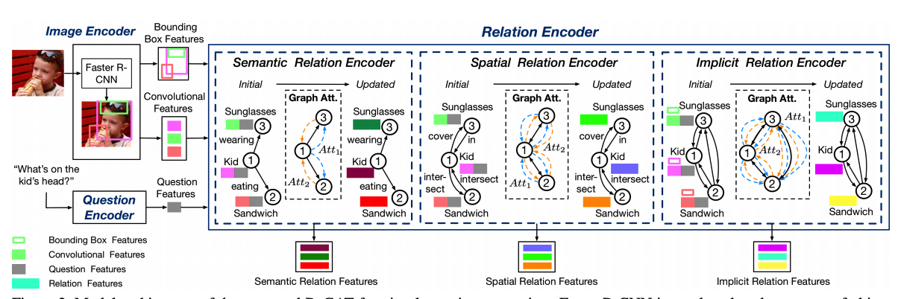
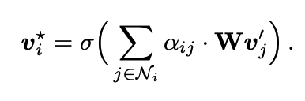
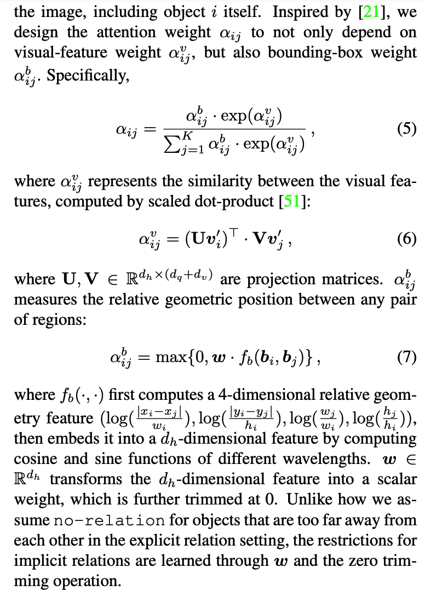
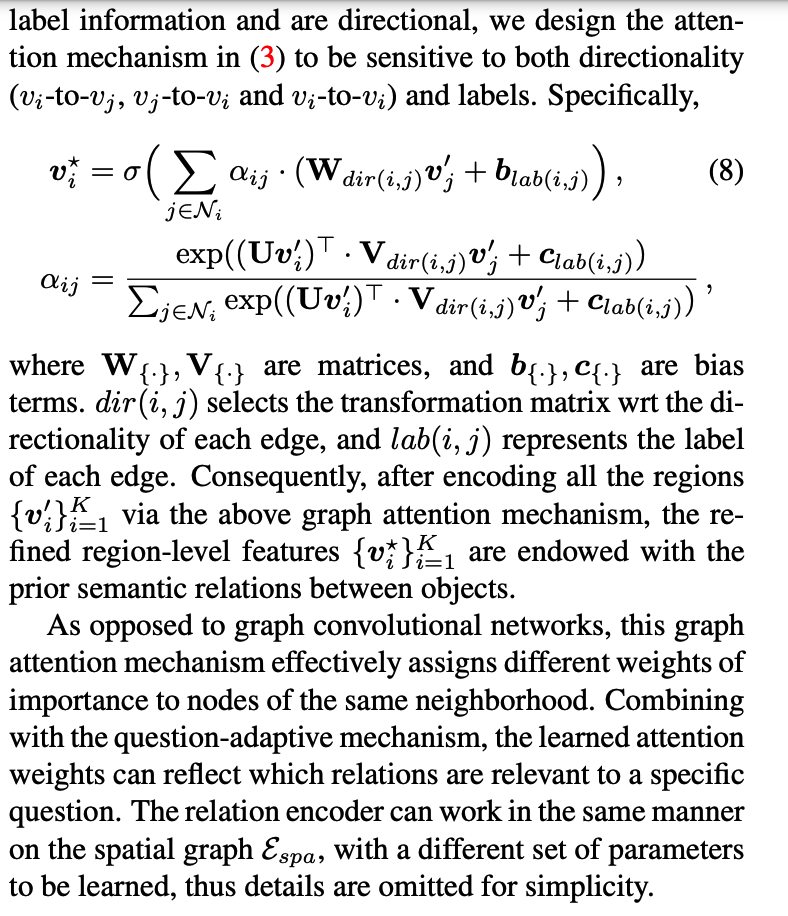

# awesome-MovieQA
关于近几年顶会顶刊Movie有关的工作

我个人觉得本质上来讲很多都是interaction，而不一定是relationship。

## 1.CVPR2020@Learning Interactions and Relationships between Movie Characters
这篇文章就是指出关系有的从视觉从可以推断，有的从dialog中推断，有的需要两者的fusion才可以得到。

很多关系都是bottom-up的，而不是parent那种top-down的。
其中interaction以及relationship都是分开讨论的，interaction表示action，然后relationship就是表示关系～我们必须同时建模才可以理解。（因为关系也改变的）


### Motivation:这里就是探索两个问题
1.can learning to jointly predict relationships and interactions help improve the performance of both?
2.can we use interaction and relationship labels at the clip or movie level and learn to identify the pair of characters involved?

### 关于问题2的核心就是将其当作是一个weak track prediction.这里就是使用label，我们能否找到pair of characters呢？


## Dual Hierarchical Temporal Convolutional Network with QA-Aware Dynamic Normalization for Video Story Question Answering@MM20
### Motviation:
1.先前的注意力网络很热火，但是他们的工作忽视了一些重点:只是考虑single temporal scale。这个就是会忽视可能一些相关的segments of videos/subtitle sequences会表示成不同的temporal scales for different samples。@@temporal granularities。

2.目前的多模态交互都是多个vector直接fuse，而忽视了那种dynamic and finegrained interactions between each word and each video feature unit。

3.先前的方法并没有fully探索QA pairs的信息。shallow exploitation of question and answer choices。


### MovieQA比起VideoQA的挑战
1）视频包含了更多的diverse information，比如背景噪声/flow of actions/所以特征空间更大而且更加复杂@比起text或者image而言。

2）多个异质的模态，比如video and subtitle。

3）video和subtitle sequences往往是非常长的，定位相关的segment是十分困难的事情。

### 1. Input Embedding
video feature就是resnet152extract，然后对于每个video@3 fps的feature进行L2 Norm，然后project into 512D。当然我们也用detected object labels而不是图像特征来作为输入。

对于textual input，比如subtitle和QA pairs，就是BERT来encode。然后Q和A进行concatenate。

### 2.多模态Alignment&Temporal Modeling
就是multihead(normalize)+BILSTM来进行融合啦。～～～套路比较多。x,y,x.y

### 3.QA-Aware Dynamic Normalization


## Bilinear Graph Networks for VQA
这篇文章尝试分析了Bilinear attention network以一个graph perspective。
### 1. Abstract
1.传统的Bilinear Attention network呢就是缺少探索细致的relationship between words for复杂的推理。

2.我们使用了两个graph相互配合～

### 2。Introduction——Novelty
1.这里主要challenge的是两篇文章BAN的话提到以前的monolithic方法忽视了words之间的interaction，以及object之间的interaction。所以就提出了一个bilinear co-attention mao考虑到每个模态内部的pair。

2.第二篇文章就是DFAF和MCAN这两篇，主要就是建模了内部的attention，外部的attention以及scaled dot-product attention～

3.但是BAN缺乏了全面的探索interactions between words in questions@@建模这个context。linear@attention就是很难表达好这种relationship～

## 1.Bilinear Attention Networks@ 2018
### Motivation
1.Co-attention这种方法就是忽视了interaction between words and visual regions，这些其实是可以帮助我们避免增加太多的计算复杂性的。

2.这里就是说我们的single attention distribution其实可以被更好利用，比如一个question中包含了多个visual concepts@由多个words进行表达的，那么使用visual 注意力distribution for each word可以探索更多的相关信息。

## 1.Relation-Aware Graph Attention Network for VQA
### 1.Motivation
1.就是找了一下VQA的一个问题，上面说到为了真正理解image对应的问题，我们必须能够识别不仅是objects，还有对应的环境grass，以及actions-eating，还有locations-at the far right。

2.可能存在的solution就是包括两个1.探索对应的geometric positions的关系-可以表示location～2.semantic dependencies-就是可以表示action。

### 2.对自己方法的描述
我们的方法就是可以reveal more fine-grained visual concepts in the image，这个就是可以in turn provides a holistic scene description。

然后in turn 提供了一个holistic scene interpretation@@可以来回答语义非常复杂的问题。。

为了能够回答这些非常high variance的问题，我们同事学习了explicit relations以及对应的implicit relations。
### 3.我们方法的简介
这里就是为了全部理解VQA中的visual scene，尤其是不同的objects之间的interactive dynamics，我们这里就是提出一个Relation-aware GAT(ReGAT)来建模这种multi-type inter-object relations via a GAT.

1.一种是explicit relations:就是geometric positions和semantic interactions。@和之前使用GCN的方法不一样，我们的GAT allows for assigning 不同的重要性@nodes of the same neighborhood。

2.一种是implicit relations:就是capture the hidden dynamics between image regions。@这里就是graph that is adaptive to each question by过滤掉question-无关的relations。

俄案后我们呢就是将question信息也引入GAT的学习过程，这个的好处就是dynamically focus on particular relation types and instances for each question on the fly。



### Image Encoder
这里就是Faster-RCNN就是36个object，2048d的视觉特征以及对应的4d的bbx特征。

### Question Encoder
这里就是BIGRU+self-attn作为最后的question encoder@1024d。

### Graph Construction
#### 1.全连接Relation Graph@implicit relation encoder
这里就是所有的权重都是learned implicit 而没有任何的prior 知识。
#### 2.Pruned Graph with Prior 知识
sparse。可能就是需要这种spatial graph

1.spatial graph:
这里就是从边的角度上来说是对称的，但是predicate就会产生变化。

2.semantic graph:
这里就是一个semantic relation分类器 on a visual relationship dataset（Visual Genome）。这时的edge不再是symmetric的了。man holding bat okay，但是相反没啦。（没有引入被动）

这个relation classifier很简单的，就是将object和subject对应的OD的vector就是先各自transform一下，然后就是通过concate在一起并且fed进分类器去分类这13+1种class，其中这个1是no-relation。

### 3.Relation Encoder(不同的问题需要不同的relations）
1.总Question-adaptive Graph Attention（对于不同的relation graph我们使用不同的注意力系数的定义，以及改变对应的projection matrix。）
```
这个引入就是不同的问题可能需要不同的relations，所以我们所做的事情就是给那些与问题最相关的relations更大的权重，
1). 首先将question和每个visual vector都进行concatenate，
2). 然后就是self-attention来更新啦，对于不同的relation graph我们使用不同的注意力系数的定义，以及改变对应的projection matrix。
```


2.分Implicit Relation:
```
这里我们的设计weight，不仅依赖于visual-feature weight，而且依赖于bbx weight。

```


3.分Explicit Relation
1）semantic relation encoder
因为这里有labels+directions，所以我们这里有注意仔细设计，对于方向的敏感性。


### 训练就是
将每个最后的visual和q进行combine predict，然后就是我们的三个GAT都是独立训练的，然后最后我们就是使用加权融合分数。

### 实验结果
这里就是每一种relation都是有意义的，然后最后的结果证明这种graph之前就进行了combine query的也是可以improve结果的，这个可以当作是Q-adaptive.


