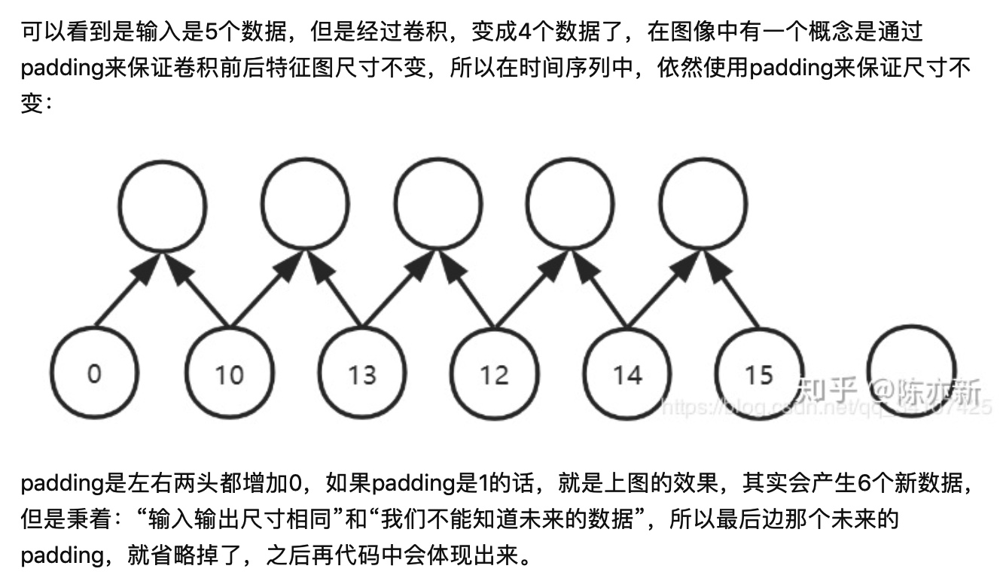
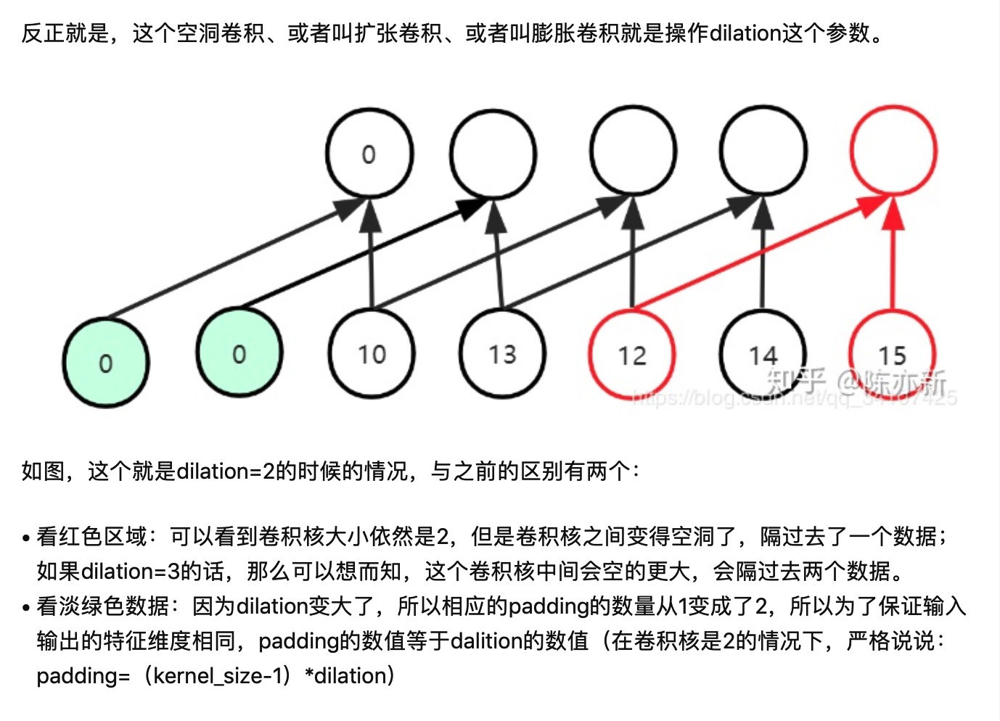
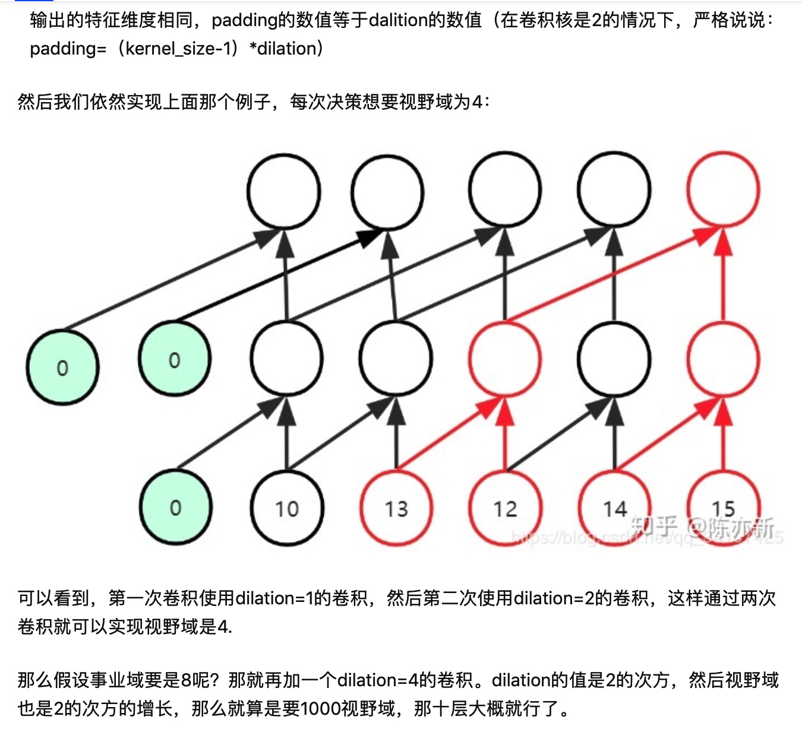

# TCN时间卷积网络，适用于序列建模任务的卷积神经网络的变体，结合了RNN和CNN架构。对TCN的初步评估表明，简单的卷积结构在多个任务和数据集上的性能优于RNN～同时表现出更长的有效记忆～

## TCN的特征是:
1.TCN架构中的卷积是因果卷积，这意味着**从将来到过去不存在信息泄露**；

2.该架构可以处理任意长度的序列@RNN，并且将其映射到相同长度的输出序列～（通过结合非常深的网络，比如residual和扩张卷积，有非常长的有效历史长度（网络可以看到很久远的过去，并且帮助预测）。

## TCN模型架构概览
如前所述，TCN基于两个原则: 网络的输入输出长度相同，且从未来到过去不存在信息泄露。

1.针对第一点，TCN就是使用1D的全卷积网络(FCN),每个隐藏层的长度与输入层相同，并且使用0填充(长度为kernel_size-1)来保持后续层与之前层长度相同～

2.第二点就是TCN使用因果卷积。

**简而言之，TCN=1D FCN+因果卷积**

这里就是使用padding可以保持尺寸不变，本质上padding是左右两头都增加0，但是padding=1的情况下，其实会产生6个新数据，但是秉着“输入输出尺寸相同”和“我们不能知道未来的数据”，所以最后那个未来的padding就被自然省略掉了～

不管是时间序列卷积还是因果卷积使用的Kernel size=2

## 因果卷积到底是什么呢？@来自wavenet
其实这里就是1D卷积的一种应用～

比如有的决策模型要求看到前面4个点的股票价格进行决策，那么3层conv=2的就可以，但是如果要求看到之前1000个时间点呢？**所以，这个时候就引入了膨胀因果卷积**

## 膨胀因果卷积Dilated Causal Convolution

这里就是空洞卷积/扩张卷积/膨胀卷积就是操作dilation这个参数～

那么如果使用dilation=2的话，每次决策如果想要视野域=4，那么这里padding=2辣。

**这里就是1D的一般卷积 stack若干个dilated COnvolution**（来扩大感受野）

**这里就是如果想要1000的视野域，那么我们只需要10层就可以了-每次的dilation都为2^(n+1)**

### 深层的TCN就有加上residual connection
### TCN@pros:
1.并行性，Conv设计完全可以并行运行，而不像RNN这种顺序处理～

2.灵活的感受野大小，这里就是有多个方式来改变其感受野的大小～**比如堆叠更多因果卷积层，使用更大的dilation扩张因子，或者增加滤波器大小都是选择**

因此，TCN可以更好控制模型的内存大小，它们也可以轻松适应不同的domain～

3.梯度稳定，和RNN不同的是，TCN的反向传播路径与序列的时间方向不同。TCN因此也就避免了梯度消失/爆炸的问题，这是RNN面临的主要问题（限制了LSTM/GRU的发展）。

4。训练内存要求低，对于RNN这种输入序列较长的情况下，LSTM和GRU就会占用大量内存存储其多个单元门的部分结果。然后，TCN中，滤波器是跨层共享的，而反向传播路径仅仅取决于网络的深度。因此，RNN在实践中消耗的内存更多～

5.可变长度输入。RNN是按照循环的方式，TCN也可以通过滑动1D卷积来接受任意长度的输入（和RNN一样），我们都可以使用TCN来替代RNN。

Cons:

3.梯度稳定，和RNN不同的是，TCN的反向传播路径与序列的时间方向不同。TCN因此也就避免了梯度消失/爆炸的问题，这是RNN面临的主要问题（限制了LSTM/GRU的发展）。.
3.梯度稳定，和RNN不同的是，TCN的反向传播路径与序列的时间方向不同。TCN因此也就避免了梯度消失/爆炸的问题，这是RNN面临的主要问题（限制了LSTM/GRU的发展）。

**这里就是如果想要1000的视野域，那么我们只需要10层就可以了-每次的dilation都为2^(n+1)**来
lin
