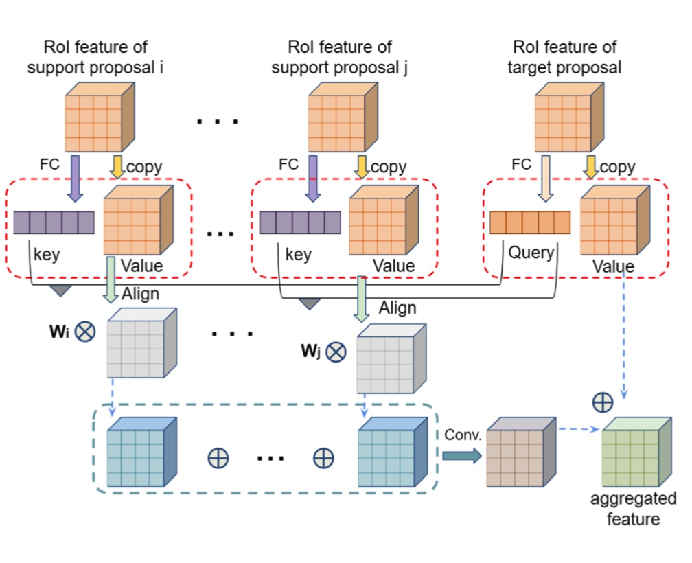
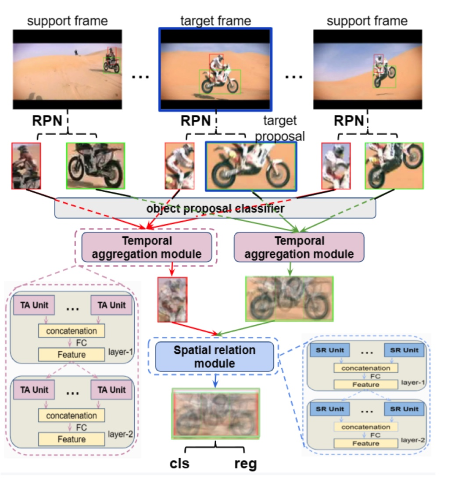

# VOD是什么样的任务呢？
挑战比如occlusion/motion blur/等等～

## 为了探索better feature aggregation@local/global support frames～@这个是很有效的～

# Exploiting Better Feature Aggregation for Video Object Detection
## 1.Motivation
1.still image中的目标检测虽然取得了很好的效果，但是事实上直接将image-based object detectors on a frame-by-frame basis to a video-based object detection task就会degrate perfroamnce

这个就是由于**occlusion/motion blur/out-of-focus camera/rare poses**

2.一个很直觉的方式就是利用temporal information@改进每个frame中的objectfeature～@**很多后处理方法就被提出～**

这些后处理方法就是探索nearby frames之间的bbx联系来改进～但是这个并没有很好benefit from training phase

3.为了克服上述post-processing的缺陷，就有了很多end-to-end feature aggregation methods去探索时序信息@nearby frames去帮助current frame**比如光流/feature correlation用来capture motion**

所以这些就是探索features in local frames去表现特征aggregation～

4。那么关系网络就很时髦了，就是利用其来获得non-local frames to objects in the current frame～**常见的就是2-stage detection stage**

二阶段的套路：
1）首先就是support frames中的目标检测

2）然后就是使用相似性来weighted sum不同frame中的相似objects～

## Motivation
现有的relation network的三个缺陷

1.他们只是考虑了temporal relation，而并没有考虑spatial relations～（而spatial对于still image而言是很有用的）

2.现有的方法只是聚合所有support frames中的proposals的信息，但是肯定带来了irrelevant classes 中的信息。

所以这些就是探索features in local frames去表现特征aggregation～.
## 我们的工作
1.class-constrained spatial-temporal relation network

-这个就是专注于region proposals，然后产生两种关系：

1）相同的object class from support frames在时间上的long time range上的依赖～

2）spatial relatons among proposals of不同的对象in the target frame～

2.correlation-based feature alignment module～

