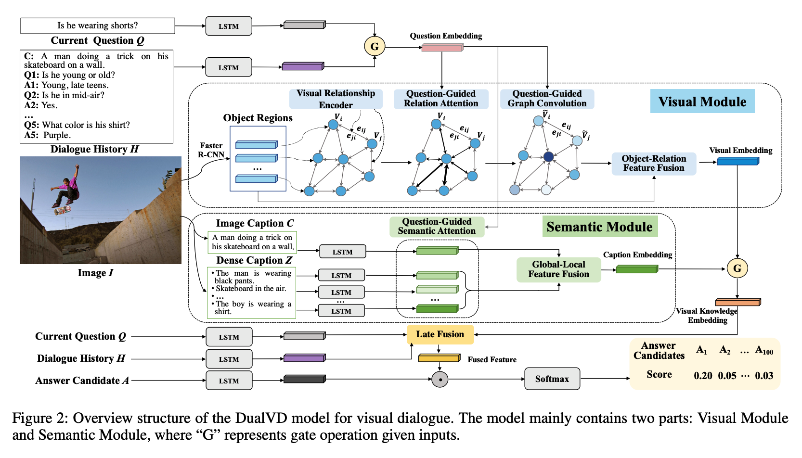

首先关于Visual Dialogue而言，这个任务就是关于一个图像由多个questions，而且这个questions会问的东西考虑非常全面，比如any objects，relationships，semantics。

## 关键
就是学习一个非常全面而且富有语义的图像表达并且能够针对不同的问题进行很好的自适应。

# DualVD: An Adaptive Dual Encoding Model for Deep Visual Understanding in Visual Dialogue

## 1.Motivation
1.就是针对事实上对于Visual Dialog而言，我们简单地图像表达@monolithic feature是不够的，因为我们想要的visual content可能会有很大的改变针对不同的问题。而且单纯的单一的feature表达是不能够表达清楚semantic-level的信息的。

2.我们就是思考人类大脑处理图像的过程，一般按照两个分支，1.会想到image的object和relationship的关系@visual 2.想到对应的higher-level abstraction@semantic view。
而现有的工作很多都是仅仅考虑appearance的。

## 2.Contribution
1.我们就是探索了认知的可能@描述一张图像从visual和semantic views。@@那么就包含了很多visual dialogue任务包括的visual content；

2.层次地visual information选择模型。



## 我们的方法
### 1.Visual-Semantic Dual Encoding
```
1.对于visual信息，那么就是主要的objects以及关系应该被kept。
2.对于semantic信息，那么就是higher-level的抽象就需要被保存了，这里就是包括先验知识。
```
我们则是使用场景图来搞定visual information，然后用caption来表示semantic信息。

### 2.Scene Graph Construction
我们这里就是2048的OD，还有对应的512d的relation embedding～然后certain关系就是会存在的@@any pairs，那些关系我们认为是unknown relationship@a special kind of relationship。那么我们这里的场景图就是fully-connected。

这里关于visual relationship encoder就是尝试将两者之间的关系嵌入到另一个semantic space中，而这个必须和NL的描述中对齐。这里就是使用余弦函数。@@@这种连续的表达就是比那种discrete label更加具有discriminative和上下文awareness。

### 3.Multi-level Image Captions。
这里就是对于questions而言provide straightforward clues for the questions without 异质gap～。

其中Global Image Caption就可以帮助回答整个scene level的问题，然后dense就是可以帮助很多local-semantic 问题。

这里使用GloVe+ELMo进行feature encoding。

### 4.Adaptive Visual-Semantic Knowledge Selection
这里就是层次性筛选feature，核心思想就是我们先intra-modal筛选一下信息@对于semantic和visual的，然后就是我们可以尝试inter-modal筛选一下信息@selective visual-semantic fusion。

这样的好处就是我们可以explicitly reveal the progressive feature selection mode and preserve fine-grained information as much as possible.

#### 4.1. Visual Mode
这里就是我们的graph module的话，我们必须建模一个relation-based graph attention network去选择与问题有关的关系信息和object信息。

1.Question-Guided Relation Attention:
强调了关键的关系。这里的核心思想就是我们首先针对history和当前的question做一个融合@self-gating，然后就是用更新之后的question来做指导。visual relationship的attention。（这里就是question和对应的关系做一个乘法），然后用attn分数乘以这个关系。

2.Question-Guided Graph Convolution:
强调了object表达。
这里就是用question和对应的拼接在一起的relation和object做乘法级别的attention，然后用来更新node。


3.Object-Relation Information Fusion:
这里就是最后融合object和关系来表达对应的question-relevant visual content。
这里就是咱们的通过GCN获得的vector肯定是relation-aware object feature，然后可以和original object feature来进行一个自适应融合。（self-gating）。

得到object feature之后（combine appearance+relationship）
然后整张图像的表达就可以考虑weighted sum。

那么这里就是Q和每个appearance embedding做的乘法的softmax融合啦。

#### 4.2 Semantic Module
Question-Guided Semantic Attention:
这个就是强调了相关的caption at both global and local level。

Global-Local Information Fusion:
这里就是和self-gating。

### Selective Visual-Semantic Fusion
那么这里就是为了回答问题，agent必须retrieve 视觉信息或者说相应的semantic信息或者同时。那么这里我们还是使用self-gating来进行自行选择。

这里实验证明自适应关系以及appearance-level feature都是很重要的。


实验结果证明visual representation对于semantic 而言更佳重要。

# DAM: Deliberation, Abandon and Memory Network for Generating Detailed and Non-repetitive Responses in Visual Dialogue.
## 1.现有的工作:
1.对于真正的人机交互而言，能够产生detailed 并且non-repetitive的response而言是实现dialogue的很重要的一步。

2.目前针对Visual Dialogue有两种策略，就是咱们的discriminative和generative。

2.1.discriminative就是select the best response in a candidate list. 

2.2.generative就是generate new response@@@而不在先前的repo中提到的。

但是对于discriminative这种方法就是会存在一些缺点，比如best matched response 可能不是最准确的合适的去achieve human-like conversation.

而针对生成式的task而言就是基于encoder-decoder这样的模块比较多，现有的这种工作的改进方向是专注于设计更佳复杂的encoder来利用好来自多个方面的信息@input～因此这些方法可能会有比较不错的improvement，但是事实上它们也有obvious limitations，比如生成不准确的细节以及repetitive words or phrases。

## 2.Contributions
1.我们可以adaptively incorporate more detailed信息@encoder来产生each word in the编码阶段。
decoder，可以兼容在各种encoder内部。

# 3.KGBN: Knowledge-Bridge Graph Network for Adaptive Vision-Text Reasoning in Visual Dialogue
## Motivation:
针对的是目前semantic gap是最大的问题，因此我们的科研就是旨在对这个进行改善。
1.就是说目前的工作仅仅依赖一个global representation from one modality去指导第二个modal的attention。@@@他们失败于缩短cross-modal semantic gap in fine granularity.不能够捕捉潜在的语义依赖@each entity。


2.而从目前的科研上来说vision knowledge可以说是visaul object-relationship-sensitive的，而且text knowledge也是context-sensitive的。@我们因此就是考虑了这个潜在的semantic dependence去缩短整个vision-text semantic gap。

3.


